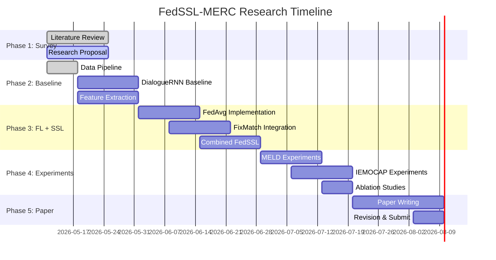

# Hiểu Về Đề Tài Nghiên Cứu: FedSSL-MERC

## Federated Semi-Supervised Learning for Multimodal Emotion Recognition in Conversations

> Tài liệu này giúp cả nhóm (Lộc, Học, Phú) hiểu rõ bức tranh toàn cảnh của đề tài, từ khái niệm cơ bản đến research gap mà nhóm sẽ giải quyết.

---

## 1. Bài Toán Gốc: Nhận Diện Cảm Xúc Trong Hội Thoại (ERC)

### 1.1 Nó là gì?

**Emotion Recognition in Conversations (ERC)** là bài toán: cho một cuộc hội thoại giữa nhiều người, xác định cảm xúc của **từng câu nói** (utterance) trong cuộc hội thoại đó.

**Ví dụ:**

```
👤 Monica: "I can't believe you did that!"         → 😡 Anger
👤 Ross:   "I'm sorry, I didn't mean to..."        → 😢 Sadness  
👤 Monica: "Well... it's okay, I guess."            → 😐 Neutral
👤 Ross:   "Really? You're the best!"               → 😊 Joy
```

### 1.2 Tại sao khó?

ERC khó hơn sentiment analysis thông thường vì:

| Thách thức | Giải thích | Ví dụ |
|:---|:---|:---|
| **Ngữ cảnh hội thoại** | Cảm xúc phụ thuộc vào câu trước đó | "That's great" có thể là mỉa mai nếu câu trước là tin xấu |
| **Nhiều người nói** | Mỗi người có trạng thái cảm xúc riêng | Monica giận nhưng Ross buồn |
| **Chuyển đổi cảm xúc** | Cảm xúc thay đổi theo dòng hội thoại | Từ giận → tha thứ → vui |
| **Đa nghĩa** | Cùng 1 câu nhưng cảm xúc khác nhau tùy context | "Wow" = ngạc nhiên, vui, hoặc mỉa mai |

### 1.3 Ứng dụng thực tế

- 🏥 **Y tế:** Phát hiện trầm cảm qua hội thoại trị liệu
- 📞 **Call center:** Đánh giá sự hài lòng khách hàng real-time
- 🤖 **Chatbot:** AI phản hồi phù hợp với cảm xúc người dùng
- 📚 **Giáo dục:** Đánh giá mức độ engagement của học sinh trong lớp online

---

## 2. Multimodal — Tại Sao Cần Nhiều Phương Thức?

### 2.1 Ba phương thức (Modalities)

Con người thể hiện cảm xúc qua **nhiều kênh cùng lúc**:

```
┌─────────────────────────────────────────────────┐
│                   UTTERANCE                      │
│                                                  │
│   📝 Text      "I'm fine"                        │
│   🔊 Audio     [giọng run, nhỏ, chậm]           │  → Cảm xúc thật: 😢 Sadness
│   🎥 Video     [mắt đỏ, cúi đầu]                │
│                                                  │
│   Chỉ nhìn text → tưởng Neutral                 │
│   Kết hợp cả 3 → nhận ra Sad                    │
└─────────────────────────────────────────────────┘
```

### 2.2 Feature Extraction (Trích xuất đặc trưng)

Mỗi modality cần model riêng để "hiểu":

| Modality | Model trích xuất | Output | Kích thước |
|:---|:---|:---|:---:|
| **Text** | RoBERTa / BERT | Vector ngữ nghĩa | 768-dim |
| **Audio** | wav2vec 2.0 / MFCC | Vector âm thanh (pitch, tempo, energy) | 40-82 dim |
| **Video** | ResNet / OpenFace | Vector khuôn mặt (FAUs) | 35-2048 dim |

### 2.3 Multimodal Fusion (Kết hợp)

Sau khi extract features, cần **fusion** (kết hợp) chúng lại:

```
Text features ──┐
                 ├──→ [Fusion Module] ──→ Emotion Prediction
Audio features ──┤
                 │
Video features ──┘
```

Các chiến lược fusion phổ biến:
- **Early fusion:** Nối (concatenate) features trước khi đưa vào model
- **Late fusion:** Mỗi modality dự đoán riêng, rồi vote/average
- **Attention fusion:** Model tự học cách kết hợp (hiện đại nhất)

---

## 3. Federated Learning (FL) — Học Phân Tán

### 3.1 Vấn đề: Dữ liệu cảm xúc là nhạy cảm

Dữ liệu hội thoại chứa thông tin **rất riêng tư**:
- Cuộc gọi tâm lý trị liệu
- Tin nhắn cá nhân
- Cuộc họp công ty

→ **Không thể gom tất cả dữ liệu về 1 chỗ** để train (vi phạm quyền riêng tư, luật GDPR, HIPAA)

### 3.2 Giải pháp: Federated Learning

FL cho phép **train model mà không cần chia sẻ dữ liệu**:

```
                    ┌──────────────┐
                    │  Server (FL) │
                    │  Global Model│
                    └──────┬───────┘
                           │
              Gửi model    │    Nhận model updates
           ┌───────────────┼───────────────┐
           │               │               │
    ┌──────▼──────┐ ┌──────▼──────┐ ┌──────▼──────┐
    │  Bệnh viện A│ │  Bệnh viện B│ │  Bệnh viện C│
    │  (data A)   │ │  (data B)   │ │  (data C)   │
    │  Train local│ │  Train local│ │  Train local│
    └─────────────┘ └─────────────┘ └─────────────┘
    
    Data KHÔNG BAO GIỜ rời khỏi bệnh viện!
```

### 3.3 Quy trình FedAvg (Thuật toán cơ bản)

```
Vòng 1:
  1. Server gửi model M₀ cho tất cả clients
  2. Mỗi client train M₀ trên data local → được M₁ᴬ, M₁ᴮ, M₁ᶜ
  3. Clients gửi model weights (KHÔNG phải data) về server
  4. Server tính trung bình: M₁ = avg(M₁ᴬ, M₁ᴮ, M₁ᶜ)
  
Vòng 2:
  1. Server gửi M₁ cho tất cả clients
  2. Lặp lại...
  
Sau 100 vòng → model M₁₀₀ gần bằng train centralized
```

### 3.4 Thách thức trong FL cho ERC

| Thách thức | Giải thích |
|:---|:---|
| **Non-IID data** | Mỗi bệnh viện/platform có phân bố cảm xúc khác nhau (BV tâm thần: nhiều sad; Call center: nhiều anger) |
| **Communication cost** | Gửi model weights qua mạng tốn bandwidth |
| **Performance gap** | FL thường kém hơn centralized 5-15% |
| **Heterogeneity** | Mỗi client có lượng data khác nhau |

---

## 4. Semi-Supervised Learning (SSL) — Học Bán Giám Sát

### 4.1 Vấn đề: Thiếu nhãn (labels)

Gán nhãn cảm xúc cho hội thoại rất **tốn kém**:
- Cần 3-5 annotators cho mỗi utterance (vì cảm xúc chủ quan)
- Mỗi annotator mất ~30 giây/utterance
- Dataset 10,000 utterances × 5 annotators × 30s = **416 giờ lao động**

→ Trong thực tế, chỉ có **~10% data có nhãn**, 90% còn lại không có nhãn.

### 4.2 Giải pháp: Semi-Supervised Learning

SSL tận dụng cả **data có nhãn (labeled)** và **data không nhãn (unlabeled)**:

```
┌─────────────────────────────────────────────┐
│            Tổng data: 10,000 utterances     │
│                                              │
│  ██ Labeled (10%):    1,000 utterances      │
│  ░░ Unlabeled (90%):  9,000 utterances      │
│                                              │
│  Centralized (chỉ labeled): WF1 ~50%       │
│  SSL (labeled + unlabeled):  WF1 ~60%  ↑↑  │
└─────────────────────────────────────────────┘
```

### 4.3 FixMatch — Phương pháp SSL chính

FixMatch là kỹ thuật SSL hiện đại, hoạt động như sau:

```
Bước 1: Với data UNLABELED
   ┌──────────────┐     ┌──────────────┐
   │ Weak Augment │     │Strong Augment│
   │ (nhiễu nhẹ)  │     │ (nhiễu mạnh) │
   └──────┬───────┘     └──────┬───────┘
          │                     │
          ▼                     ▼
   ┌──────────────┐     ┌──────────────┐
   │   Model dự   │     │   Model dự   │
   │   đoán: Joy  │     │   đoán: ???  │
   │   (95% tin)  │     │              │
   └──────┬───────┘     └──────────────┘
          │                     ▲
          │   Pseudo-label      │
          └────────────────────→│
                                │
   Nếu confidence > 0.95:      │
   Dùng "Joy" làm nhãn giả ───→ Train model trên bản strong augment
```

**Ý tưởng cốt lõi:**
1. Đưa data qua **weak augmentation** (nhiễu nhẹ) → model dự đoán
2. Nếu model **rất tự tin** (>95%) → coi dự đoán đó là nhãn thật (pseudo-label)
3. Đưa cùng data qua **strong augmentation** (nhiễu mạnh) → train model dự đoán ra pseudo-label đó
4. → Model học được từ data không nhãn!

---

## 5. Kết Hợp: FedSSL-MERC (Đề Tài Của Nhóm)

### 5.1 Bức tranh toàn cảnh

```
┌─────────────────────────────────────────────────────┐
│                    FL SERVER                         │
│              ┌─────────────────┐                    │
│              │  Global Model   │                    │
│              │  (DialogueRNN)  │                    │
│              └────────┬────────┘                    │
│                       │                              │
│         ┌─────────────┼─────────────┐               │
│         │             │             │               │
│    ┌────▼────┐   ┌────▼────┐  ┌────▼────┐          │
│    │Client 1 │   │Client 2 │  │Client 3 │          │
│    │Hospital │   │CallCtr  │  │ChatApp  │          │
│    ├─────────┤   ├─────────┤  ├─────────┤          │
│    │█ 10% L  │   │█ 5% L   │  │█ 15% L  │          │
│    │░ 90% U  │   │░ 95% U  │  │░ 85% U  │          │
│    ├─────────┤   ├─────────┤  ├─────────┤          │
│    │FixMatch │   │FixMatch │  │FixMatch │          │
│    │SSL local│   │SSL local│  │SSL local│          │
│    └─────────┘   └─────────┘  └─────────┘          │
│                                                      │
│  L = Labeled (có nhãn)    U = Unlabeled (không nhãn)│
└─────────────────────────────────────────────────────┘
```

### 5.2 Tại sao kết hợp FL + SSL cho ERC là mới?

Nhìn vào literature hiện tại:

| Lĩnh vực | Đã có nghiên cứu? | Ví dụ |
|:---|:---:|:---|
| ERC (centralized) | ✅ Rất nhiều | DialogueRNN, COSMIC, DialogueGCN |
| Multimodal ERC | ✅ Nhiều | MMGCN, MM-DFN |
| FL for NLP | ✅ Một số | FedNLP, Fed-Sentiment |
| SSL for NLP | ✅ Một số | UDA, MixText |
| **FL + SSL for ERC** | ❌ **Chưa có** | **← Đây là gap của nhóm** |

### 5.3 Contribution dự kiến (đóng góp khoa học)

Để đạt Q1, paper cần **3-4 contributions rõ ràng**:

> **C1:** Đề xuất framework FedSSL-MERC — kết hợp FL và SSL lần đầu cho bài toán multimodal ERC
>
> **C2:** Thiết kế chiến lược pseudo-labeling phù hợp cho dữ liệu hội thoại (conversation-aware pseudo-labeling) — khác với FixMatch gốc vì cần xét ngữ cảnh hội thoại
>
> **C3:** Phân tích ảnh hưởng của Non-IID data đến performance ERC trong setting federated — chưa ai nghiên cứu
>
> **C4:** Đạt kết quả SOTA trong setting federated trên 2 benchmark (IEMOCAP + MELD) với chỉ 10% labeled data

---

## 6. Các Model Quan Trọng Cần Biết

### 6.1 DialogueRNN (Baseline chính)

```
Utterance 1 ─→ [Global GRU] ─→ [Party GRU] ─→ [Emotion GRU] ─→ Emotion 1
                     ↓               ↓               ↓
Utterance 2 ─→ [Global GRU] ─→ [Party GRU] ─→ [Emotion GRU] ─→ Emotion 2
                     ↓               ↓               ↓
Utterance 3 ─→ [Global GRU] ─→ [Party GRU] ─→ [Emotion GRU] ─→ Emotion 3

• Global GRU:  Theo dõi ngữ cảnh TOÀN BỘ cuộc hội thoại
• Party GRU:   Theo dõi trạng thái TỪNG NGƯỜI NÓI
• Emotion GRU: Tạo biểu diễn cảm xúc cuối cùng
```

### 6.2 FedAvg vs FedProx

| | FedAvg | FedProx |
|:---|:---|:---|
| Ý tưởng | Trung bình đơn giản | Trung bình + regularization |
| Non-IID | Kém | Tốt hơn |
| Code | Đơn giản | Thêm 1 loss term |
| Khi nào dùng | Baseline | Khi data rất non-IID |

### 6.3 FixMatch vs FlexMatch

| | FixMatch | FlexMatch |
|:---|:---|:---|
| Threshold | Cố định (0.95) | Tự điều chỉnh theo class |
| Vấn đề | Class hiếm (fear, disgust) ít khi vượt threshold | Giải quyết được |
| Khi nào dùng | Baseline SSL | Khi class imbalance nặng |

---

## 7. Metrics Đánh Giá

### Weighted F1-Score (WF1) — Metric chính

```
                    2 × Precision × Recall
F1 per class = ─────────────────────────────
                    Precision + Recall

WF1 = Σ (weight_i × F1_i)    với weight_i = số mẫu class i / tổng mẫu
```

**Tại sao dùng WF1 thay vì Accuracy?**

Vì MELD có **neutral chiếm 47%** — model chỉ cần đoán tất cả là neutral cũng được accuracy ~47%, nhưng WF1 sẽ rất thấp vì các class khác F1 = 0.

### Mục tiêu performance

```
                        IEMOCAP    MELD
Centralized baseline:    ~65%      ~57%     (DialogueRNN)
Federated baseline:      ~55%      ~48%     (FedAvg, 100% labeled)
FedSSL (nhóm):           ~60%      ~53%     (FedAvg + FixMatch, 10% labeled)
                                              ↑
                                    Thu hẹp gap, dùng ít label
```

---

## 8. Timeline Nghiên Cứu (14 Tuần)



---

## 9. Thuật Ngữ Quan Trọng

| Thuật ngữ | Viết tắt | Nghĩa |
|:---|:---:|:---|
| Emotion Recognition in Conversations | ERC | Nhận diện cảm xúc trong hội thoại |
| Multimodal | MM | Đa phương thức (text + audio + video) |
| Federated Learning | FL | Học liên bang (train không chia sẻ data) |
| Semi-Supervised Learning | SSL | Học bán giám sát (dùng cả labeled + unlabeled) |
| Non-IID | — | Dữ liệu không đồng nhất giữa các client |
| Pseudo-label | — | Nhãn giả do model tự tạo cho unlabeled data |
| Weighted F1 | WF1 | Metric đánh giá chính (xử lý class imbalance) |
| FedAvg | — | Federated Averaging — thuật toán FL cơ bản |
| FixMatch | — | Kỹ thuật SSL dùng consistency regularization |
| DialogueRNN | — | Model baseline chính cho ERC |
| Utterance | — | Một câu nói trong hội thoại |
| Modality | — | Kênh thông tin (text, audio, hoặc video) |
| Feature extraction | — | Trích xuất đặc trưng từ raw data |
| Fusion | — | Kết hợp features từ nhiều modalities |
| Client | — | Một node trong FL (bệnh viện, platform,...) |
| Round | — | Một vòng giao tiếp server ↔ clients trong FL |
| Augmentation | — | Biến đổi data (thêm nhiễu) để tăng đa dạng |
| Confidence threshold | τ | Ngưỡng tin cậy để chấp nhận pseudo-label |
| Ablation study | — | Thí nghiệm bỏ từng thành phần để đánh giá tác dụng |

---

## 10. Câu Hỏi Thường Gặp

### Q: Tại sao không chỉ dùng GPT/LLM cho ERC?
**A:** LLMs (GPT, LLaMA) rất tốt cho text-only ERC, nhưng:
- Không xử lý được audio/video natively
- Quá lớn để chạy FL (mỗi client cần GPU mạnh)
- Latency cao, không phù hợp real-time
- Nhóm dùng DialogueRNN (nhỏ, 1.5M params) → phù hợp FL

### Q: 10% labeled data có quá ít không?
**A:** Trong thực tế còn ít hơn. Call center có hàng triệu cuộc gọi nhưng chỉ vài nghìn được gán nhãn. 10% là setting phổ biến trong SSL research.

### Q: Non-IID data nghĩa là gì cụ thể?
**A:** Ví dụ:
- Bệnh viện tâm thần: 70% sad, 20% fear, 10% neutral
- Call center bán hàng: 50% neutral, 30% joy, 20% anger
- → Phân bố cảm xúc rất khác nhau → model khó hội tụ

### Q: Kết quả cần đạt bao nhiêu để publish Q1?
**A:** Không cần beat SOTA centralized. Cần chứng minh:
1. FedSSL > FedAvg baseline (trong cùng setting federated)
2. FedSSL với 10% label ≈ FedAvg với 100% label
3. Phân tích insights: Non-IID ảnh hưởng thế nào, modality nào quan trọng nhất
